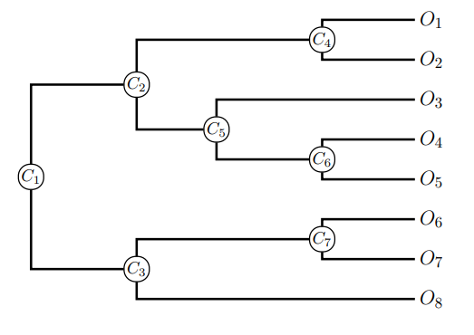
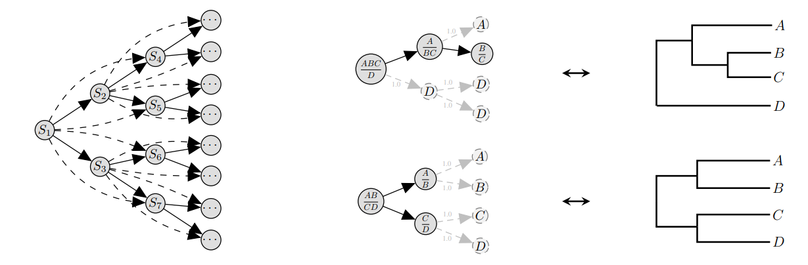

# Computing tree probabilities from a set of trees

**Problem**: Given a set of $M$ trees $\boldsymbol{X}_M = \{X_1, \ldots, X_M\}$, compute (with confidence) the probability $\pi(y)$ of a new tree $y \notin \boldsymbol{X}_M$.

[Hoehnna & Drummond (2012)](https://doi.org/10.1093/sysbio/syr074) introduced the idea of a conditional clade probability, which assumed some independence between clades and scored trees based on the product of their CCDs.
These were then used to guide MCMC proposals.

[Larget (2013)](https://doi.org/10.1093/sysbio/syt014) introduced the idea of  (approximate) **conditional independence of separated subtrees** (CISS) hypothesis.
The resulting conditional clade distributions (CCD)forgo computing the normalisation and thus are easier to compute.
While the CCP computes `Pr(clade | parent of clade)`, the CCD computed `Pr(all children clades | parent clade)`.

[Whidden & Matsen (2015)](https://doi.org/10.1093/sysbio/syv006) noticed that the CCD
> underestimated the posterior for sub-peaks and overestimated the posterior between peaks.

which suggested that 
> the conditional independence assumption on clades made by this method was too strong.

Then [Zhang & Matsen (2018)](https://papers.nips.cc/paper_files/paper/2018/file/b137fdd1f79d56c7edf3365fea7520f2-Paper.pdf) suggested an approach based on _subsplits_.

Consider the tree $T$:

We have that
$$\pi(T) = \operatorname{Pr}(C_2, C_3, C_4, C_5, C_6, C_7).$$
The CCD decomposition is
$$
p_{\textrm{CCD}}(T) = \pi_{1}(C_2, C_3) \pi_{2}(C_4, C_5 \mid C_2)\pi_{3}(C_6 \mid C_5) \pi_{4}(C_7 \mid 
C_3).
$$

A subsplit Bayesian network (SBN) represents the tree as a series of subsplits of the clades.
For a clade $X$, we call $(Y, Z)$ a (compatible) subsplit if $Y \cup Z = X$ and $Y \cap Z = \emptyset$.

A SBN representation of $T$ would be 

$$\mathcal{T}_S = \{(C_2, C_3), (C_4, C_5), (\{O_3\}, C_6),(C_7, \{O_8\})\}.$$

Thus a simple SBN approximation of $\pi(T)$ would be
$$
p_{\textrm{SBN}}(T) = \kappa_{1}(C_2, C_3) \kappa_{2}(C_4, C_5 \mid C_2, C_3)\kappa_{3}(C_6 \mid C_4, C_5) \kappa_{4}(C_7 \mid C_2, C_3).
$$
Notice how this reduces to $p_{\textrm{CCD}}$ under the further simplifications:
$$
\begin{aligned}
\kappa_{2}(C_4, C_5 \mid C_2, C_3) &\to \pi_{2}(C_4, C_5 \mid C_2),\\\\
\kappa_{3}(C_6 \mid C_4, C_5) &\to \pi_{3}(C_6 \mid C_5),\\\\
\kappa_{4}(C_7 \mid C_2, C_3) & \to \pi_{4}(C_7 \mid 
C_3).
\end{aligned}
$$
This is precisely simplifying things by saying that once you condition on one of the ancestors, you get independence.
This leads to the general representation

$$p_{\textrm{SBN}}(T) = \kappa_{1}(S_1) \prod_{i=2}^{N-1}\kappa_{i}\left(S_i \mid S_{P_i}\right),$$
where where $P_i$ denotes the index set of the parent nodes of $S_i$.

[bito](https://github.com/phylovi/bito) (Bayesian Inference of Trees via Optimization) is a Python/TensorFlow/PyTorch library makes this much easier.

Finally [Zhang (2020)](https://proceedings.neurips.cc/paper/2020/file/d96409bf894217686ba124d7356686c9-Paper.pdf), [Zhang & Matsen (2022)](https://arxiv.org/abs/2204.07747) and [Zhang 2023](https://arxiv.org/abs/2302.08840) use SBNs as a starting off point to propose variational approaches to phylogenetic trees (including their branch lengths), and idea also explored in [Karcher, Zhang and Matsen (2021)](https://arxiv.org/abs/2104.11191) for inferring supertrees.

## References

